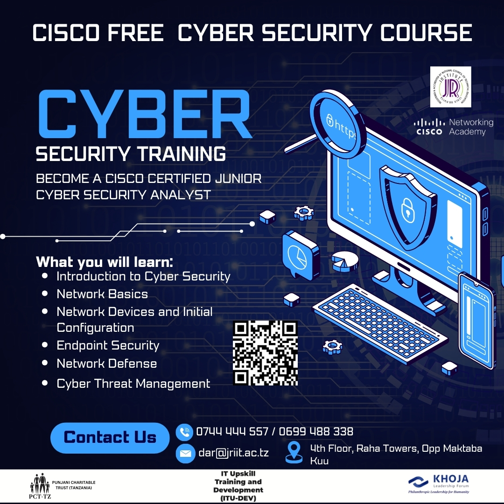
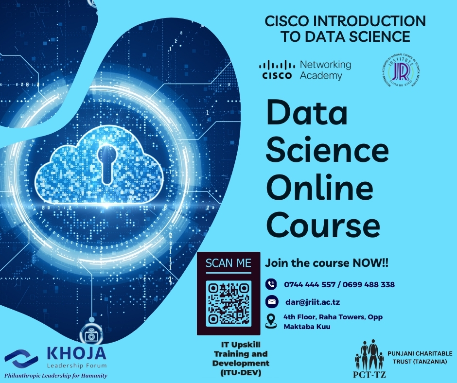

# JR IIT Cisco Certified Networking Academy
**JR Institute of Information Technology** has partnered with **Cisco Networking Academy** to offer the following online, self-paced courses. All you need is a laptop, internet connection, and the desire to explore new technologies. What are you waiting for? Register for the courses now and earn your Digital Badge from CISCO.

1. Introduction to Cyber Security

[Click on Link to Regsiter](https://skillsforall.com/course/introduction-to-cybersecurity?courseLang=en-US&instance_id=8d91886e-bc09-49ca-b0af-1bb816d49a00)

2. Introduction to Data Science

[Click on Link to Regsiter](https://skillsforall.com/course/introduction-data-science?courseLang=en-US&instance_id=61f18b95-945c-45d0-87e5-0d47bd241059)
